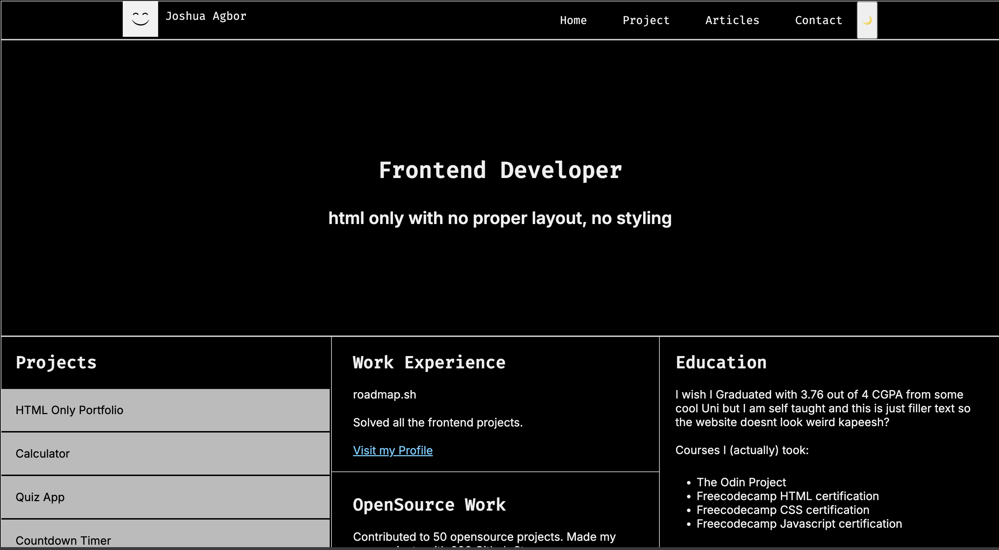
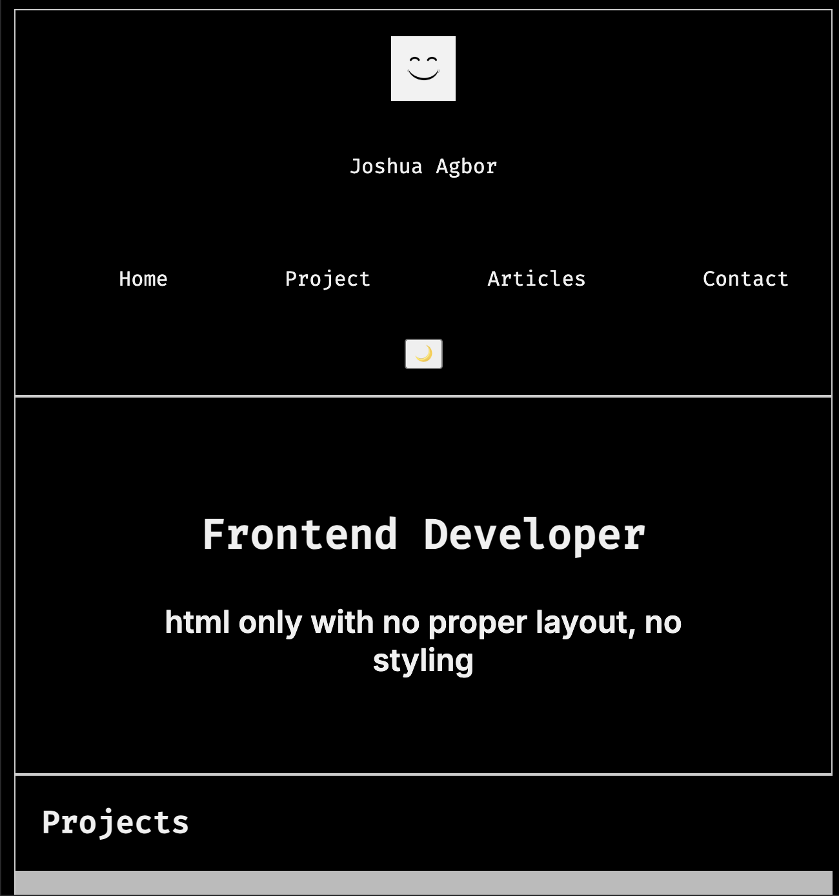

# Portfolio Website

This is a responsive personal portfolio website built with **HTML** and **CSS**. It serves as a showcase of my projects, work experience, open-source contributions, and educational background. The goal of this project was to practice semantic HTML, clean CSS architecture, responsive design, and dark mode implementation — all without using any CSS frameworks.

## 🌐 Live Demo

[View Website](https://buildinrythm.github.io/V2-Portfolio/)  

---

## ✨ Features

- ⚙️ **HTML-only Structure** – Built from scratch with clean semantic markup.
- 🎨 **Custom CSS Styling** – Fully styled layout using CSS without external frameworks.
- 📱 **Responsive Design** – Optimized for desktop and mobile views using Flexbox and media queries.
- 🌙 **Dark Mode Support** – Toggleable via CSS classes using custom properties (`:root` and `.dark-mode`).
- 🧱 **Structured Content** – 3-column layout for Projects, Experience, and Education.
- 💬 **Teacher Reviews Section** – Showcasing testimonials and feedback in a clean card layout.

---

## 🛠 Technologies Used

- **HTML5** – Semantic and accessible structure.
- **CSS3** – Custom styling using Flexbox, transitions, and variables.
- **Google Fonts** – Inter and Fira Code for typography.

---

## 📁 Project Structure

index.html
style.css
README.md
logo.jpg
---

## 💡 Lessons Learned

- Improved CSS layout skills, especially using Flexbox for responsive grids and columns.
- Learned to use semantic tags and structure HTML for accessibility and SEO.
- Practiced creating a mobile-first responsive design.
- Gained comfort with custom properties and dark mode theming.
- Learned the importance of debugging with browser DevTools (Inspect Element).

---

## 📸 Screenshots
 

---

## 🚀 How to Use

1. Clone the repo:
   ```bash
   git clone https://github.com/buildinrythm/V2-Portfolio
   Open index.html in your browser.

(Optional) Deploy on GitHub Pages or Netlify to make it live.

📌 Future Improvements
Add animations (e.g., fade-ins, hover effects).

Expand project sections with case studies or code links.

Include downloadable CV and contact form functionality.

🙌 Acknowledgements
Thanks to Google Fonts for typography resources.

Inspired by minimalist portfolio layouts found on roadmap.sh, CodePen, and GitHub.

🧑‍💻 Author
Joshua Agbor
https://github.com/buildinrythm 

---

